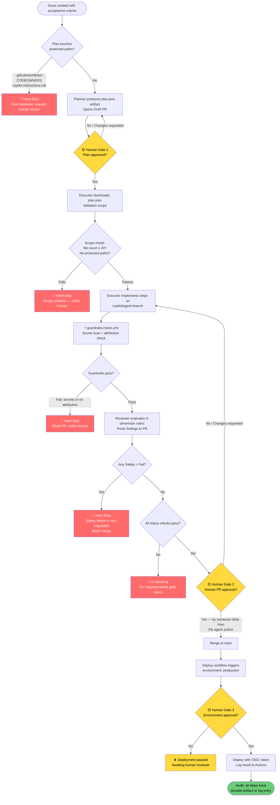

# Agentic AI Development — Complete Workflow Diagram

This file provides a visual reference for the full agentic AI development lifecycle on GitHub. It covers all actors, phases, human gates, artifacts, and hard stops.

> **GH-600 topics covered:** All 6 — Architecture (1), Tool Use (2), Memory/State (3), Evaluation (4), Multi-Agent (5), Guardrails (6)

---

## Legend

| Symbol | Meaning |
| --- | --- |
| 🟢 **Autonomous** | Agent acts without waiting for human input |
| 🟡 **Human gate** | Execution pauses; a named human must explicitly approve to continue |
| 🔴 **Hard stop** | Agent must halt immediately and post a comment; cannot continue autonomously |
| 📦 **Artifact** | Durable output produced and uploaded at this step |
| 🔒 **Platform enforced** | Control backed by branch protection, CODEOWNERS, or environment rules |
| ⚡ **CI/Actions** | Step runs inside GitHub Actions and is fully logged |
| 👥 **Specialist swarm** | Multiple agents run in parallel (read-only); a coordinator synthesizes results |

---

## Actors

| Actor | Type | Role in the workflow |
| --- | --- | --- |
| **Human (PM / Developer / Admin)** | Person | Creates issues, approves plans, reviews PRs, approves deploys, handles incidents |
| **Planner Agent** | AI agent | Reads context and produces a structured plan artifact — never writes code |
| **Executor Agent** | AI agent | Implements approved plan steps on a scoped branch — no merge rights |
| **Reviewer Agent** | AI agent | Validates correctness, scope, safety, auditability after execution |
| **Coordinator Agent** | AI agent | Synthesizes findings from specialist agents into one final report |
| **GitHub Platform** | Platform | Issues, PRs, branch protection, environments, CODEOWNERS, Audit Log |
| **GitHub Actions** | CI/CD | Runs guardrails checks, scope control, secret scan, status checks |
| **MCP Servers** | External tools | Approved external tools governed by `.github/mcp-config.json` |
| **Production Environment** | Deployment target | Gated behind a required human reviewer |

---

## Sequence Diagram — Full Lifecycle

```mermaid
sequenceDiagram
    autonumber
    actor Human
    participant GitHub as GitHub Platform
    participant Planner as Planner Agent
    participant Executor as Executor Agent
    participant Reviewer as Reviewer Agent
    participant Coordinator as Coordinator Agent
    participant CI as GitHub Actions (CI)
    participant MCP as MCP Servers
    participant Prod as Production Environment

    %% ── Phase 0: Intent Capture ────────────────────────────────────────────
    Note over Human,GitHub: PHASE 0 — Intent Capture (Autonomy Level 1)
    Human->>GitHub: Create Issue with acceptance criteria, out-of-scope items, risk note
    GitHub-->>Human: Issue #N created and labeled
    Note over GitHub: 📦 Issue = durable intent artifact
    Note over GitHub: 🔒 Optional: Planner Agent labels/categorizes at Level 1

    %% ── Phase 1: Planning ──────────────────────────────────────────────────
    Note over Planner,GitHub: PHASE 1 — Planning (Autonomy Level 1)
    Planner->>GitHub: Read Issue #N, copilot-instructions.md, copilot-memory.md
    Planner->>MCP: Read relevant repo files (contents:read only)
    MCP-->>Planner: File contents
    Note over Planner: 🟢 Reads are autonomous; no writes yet
    Planner->>CI: Upload plan.json artifact (steps, file list, requires_human_approval: true)
    Note over CI: 📦 plan.json = handoff artifact (artifact-schema.json)
    Planner->>GitHub: Open Draft PR with plan as description (no code changes)
    Note over GitHub: 📦 Draft PR = proposal artifact + audit trail entry

    Note over Human,GitHub: 🟡 HUMAN GATE #1 — Plan Approval
    GitHub-->>Human: Notify: Draft PR ready for plan review
    Human->>GitHub: Review plan → Approve or Request Changes
    Note over Human: If diff touches .github/workflows/, CODEOWNERS,\nor copilot-instructions.md → 🔴 HARD STOP here

    %% ── Phase 2: Execution ─────────────────────────────────────────────────
    Note over Executor,CI: PHASE 2 — Execution (Autonomy Level 2)
    Executor->>CI: Download plan.json artifact
    Executor->>Executor: Validate scope (file count ≤ limit, no protected paths)
    Note over Executor: 🔴 HARD STOP if plan includes .github/workflows/ or CODEOWNERS
    Executor->>GitHub: Create scoped branch (copilot/<task> or agent/<task>)
    Executor->>GitHub: Implement only approved steps; commit with rationale message
    Note over Executor: 🟢 Only files listed in plan.json are touched
    Executor->>CI: Upload execution-result.json (steps_completed, files_modified, status)
    Note over CI: 📦 execution-result.json = executor handoff artifact

    CI->>CI: ⚡ guardrails-check.yml runs (scope control + secret scan + attribution check)
    Note over CI: 🔴 HARD STOP if >20 files changed, secrets found, or no PR description

    %% ── Phase 3: Review ────────────────────────────────────────────────────
    Note over Reviewer,CI: PHASE 3 — Review (Autonomous, read-only)
    Reviewer->>CI: Download plan.json + execution-result.json
    Reviewer->>Reviewer: Cross-check planned vs executed files
    Reviewer->>Reviewer: Evaluate 4-dimension rubric (Correctness, Scope, Safety, Auditability)
    Note over Reviewer: 🟢 Reviewer is read-only; no write access to code
    Reviewer->>GitHub: Post structured review comment with findings and recommendation
    Note over GitHub: 📦 PR review comment = reviewer handoff artifact

    Note over Reviewer,Coordinator: Optional: Specialist swarm pattern
    Note over Reviewer,Coordinator: 👥 Security + Docs + Tests reviewers run in parallel
    Coordinator->>CI: Download all specialist findings
    Coordinator->>GitHub: Post synthesized summary comment on PR

    %% ── Phase 4: Merge Gate ────────────────────────────────────────────────
    Note over Human,GitHub: PHASE 4 — Merge Gate (Autonomy Level 2)
    CI->>GitHub: ⚡ All status checks must pass (guardrails-check, lint, scope-control)
    GitHub->>Human: ⚡ CODEOWNERS auto-assigns reviewer if sensitive paths touched
    Note over GitHub: 🔒 Branch protection: requires ≥1 human approving review
    Note over GitHub: 🔒 Branch protection: all status checks must pass

    Note over Human,GitHub: 🟡 HUMAN GATE #2 — PR Merge
    Human->>GitHub: Read reviewer findings → Approve PR
    Note over Human: 🔴 HARD STOP: the agent that authored the PR may NOT approve it
    Human->>GitHub: Merge PR into main
    Note over GitHub: 📦 Merge commit = permanent audit trail entry

    %% ── Phase 5: Deploy ────────────────────────────────────────────────────
    Note over CI,Prod: PHASE 5 — Deployment (Autonomy Level 4)
    GitHub->>CI: Merge triggers deployment workflow
    CI->>Prod: Job targets environment: production
    Note over Prod: 🔒 Environment protection rule: required reviewer

    Note over Human,Prod: 🟡 HUMAN GATE #3 — Production Deploy Approval
    Prod-->>Human: Notify: deployment pending approval
    Human->>Prod: Approve deployment
    CI->>Prod: Deploy with OIDC short-lived token (no static secrets)
    Note over CI: ⚡ Deployment result logged to Actions; OIDC token expires after use
    Prod-->>CI: Deployment success / failure

    %% ── Phase 6: Audit and Evaluation ──────────────────────────────────────
    Note over Human,CI: PHASE 6 — Audit and Evaluation (Ongoing)
    CI->>GitHub: Upload run report artifact (run_id, sha, status)
    Note over GitHub: 📦 Every step produced a durable artifact or log entry
    Note over GitHub: 🔒 GitHub Audit Log captures all API events (actor, action, timestamp)
    Human->>CI: ⚡ Run agent-eval.yml against golden scenarios (optional)
    CI->>GitHub: Commit evals/results-v<N>.md with scored rubric results

    %% ── Phase 7: Incident Response (if needed) ─────────────────────────────
    Note over Human,GitHub: PHASE 7 — Incident Response (if harmful action detected)
    Human->>GitHub: git revert <bad-sha> OR close PR + delete branch
    Human->>GitHub: File incident report (.github/ISSUE_TEMPLATE/agent-incident.md)
    Human->>GitHub: Update copilot-instructions.md, guardrails.md, or CODEOWNERS
    Note over Human: 🔴 Prompt-only fixes are insufficient; platform controls must be updated
```

---

## Decision Flowchart



---

## Step-to-Control Reference Table

Every step in the workflow maps to a GitHub platform control and a GH-600 topic.

| Phase | Step | GitHub control | GH-600 topic |
| --- | --- | --- | --- |
| 0 — Intent | Issue with acceptance criteria | GitHub Issues | Topic 1 |
| 1 — Plan | Draft PR with plan description | Pull Requests | Topic 1 |
| 1 — Plan | plan.json handoff artifact | Actions artifacts | Topic 3, 5 |
| 1 — Human gate #1 | Plan review and approval | Human review of Draft PR | Topic 1, 6 |
| 2 — Execute | Scoped branch creation | Branch naming (`copilot/`) | Topic 1 |
| 2 — Execute | File-count scope validation | Custom guardrails check | Topic 4 |
| 2 — Execute | execution-result.json upload | Actions artifacts | Topic 3, 5 |
| 2 — Execute | Secret scan on diff | `guardrails-check.yml` | Topic 4, 6 |
| 3 — Review | 4-dimension rubric evaluation | PR review comment | Topic 4 |
| 3 — Review | Specialist swarm synthesis | Coordinator job in Actions | Topic 5 |
| 4 — Merge gate | All status checks pass | Branch protection — required checks | Topic 2, 6 |
| 4 — Merge gate | CODEOWNERS auto-assignment | CODEOWNERS file | Topic 1, 6 |
| 4 — Human gate #2 | Required human PR approval | Branch protection — required reviews | Topic 1, 6 |
| 4 — Merge gate | No self-approval | Hard stop rule #7 in `guardrails.md` | Topic 6 |
| 5 — Deploy | Environment gate | `environment: production` | Topic 2, 6 |
| 5 — Human gate #3 | Production deploy approval | Environment protection rule — required reviewer | Topic 6 |
| 5 — Deploy | Short-lived cloud auth | OIDC (`id-token: write`) | Topic 2 |
| 6 — Audit | Run report artifact | Actions upload-artifact | Topic 3 |
| 6 — Audit | API event traceability | GitHub Audit Log | Topic 6 |
| 6 — Audit | Eval run and versioned results | `agent-eval.yml` + `evals/results-v<N>.md` | Topic 4 |
| 7 — Incident | Revert harmful commit | `git revert` + PR close | Topic 6 |
| 7 — Incident | Incident report filed | `.github/ISSUE_TEMPLATE/agent-incident.md` | Topic 6 |
| 7 — Incident | Platform controls updated | `guardrails.md`, CODEOWNERS, branch protection | Topic 6 |

---

## Autonomy Level Overlay

Each phase operates at a specific autonomy level. Use this to answer "what controls are required at this step?"

| Phase | Autonomy level | Key controls |
| --- | --- | --- |
| 0 — Intent | Level 1 | Agent labels only; human authors acceptance criteria |
| 1 — Plan | Level 1 | Draft PR only; human must approve before execution |
| 2 — Execute | Level 2 | Branch-scoped writes; guardrails-check required |
| 3 — Review | Level 2 | Read-only; PR comment output only |
| 4 — Merge | Level 2 | Human approval required; no self-approval |
| 5 — Deploy | Level 4 | Environment gate; OIDC; required human reviewer |
| 6 — Audit | Level 0–2 | Read and report only |
| 7 — Incident | Human-only | Agent may not execute rollback autonomously |

---

## Related Files

| File | What it adds |
| --- | --- |
| [topics/cheat-sheets.md](cheat-sheets.md) | Summary tables for every decision area |
| [.github/copilot-instructions.md](../.github/copilot-instructions.md) | Agent standing orders for this repo |
| [.github/guardrails.md](../.github/guardrails.md) | Full hard-stop list and autonomy matrix |
| [templates/artifact-schema.json](../templates/artifact-schema.json) | Handoff artifact JSON schema |
| [templates/workflow-multi-agent-example.yml](../templates/workflow-multi-agent-example.yml) | Planner → executor → reviewer pipeline YAML |
| [deep-dives/docs-index.md](../deep-dives/docs-index.md) | All authoritative GitHub Docs URLs |
